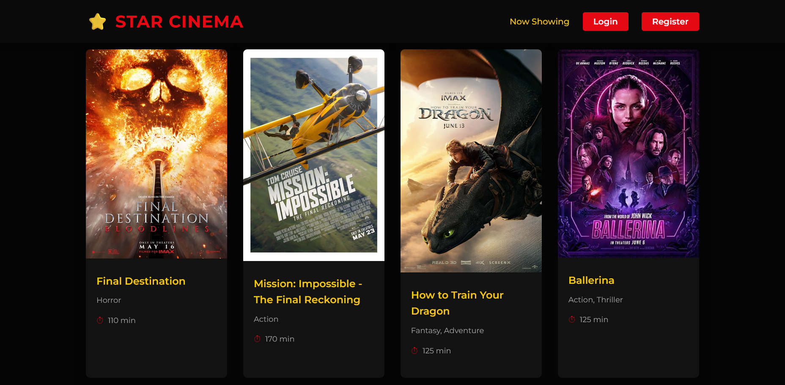
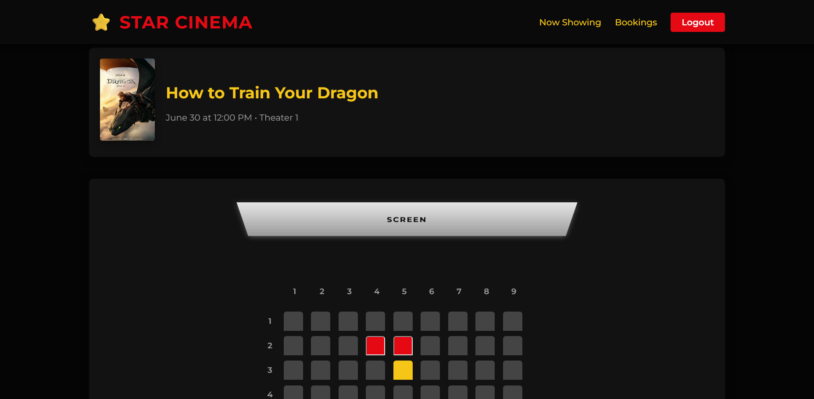
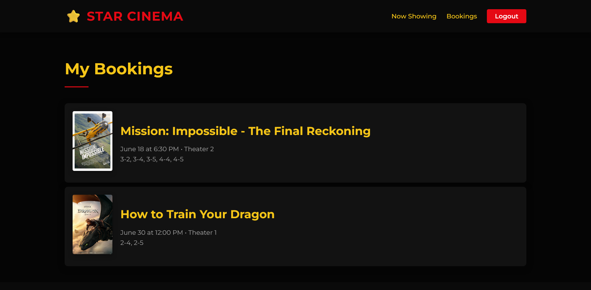
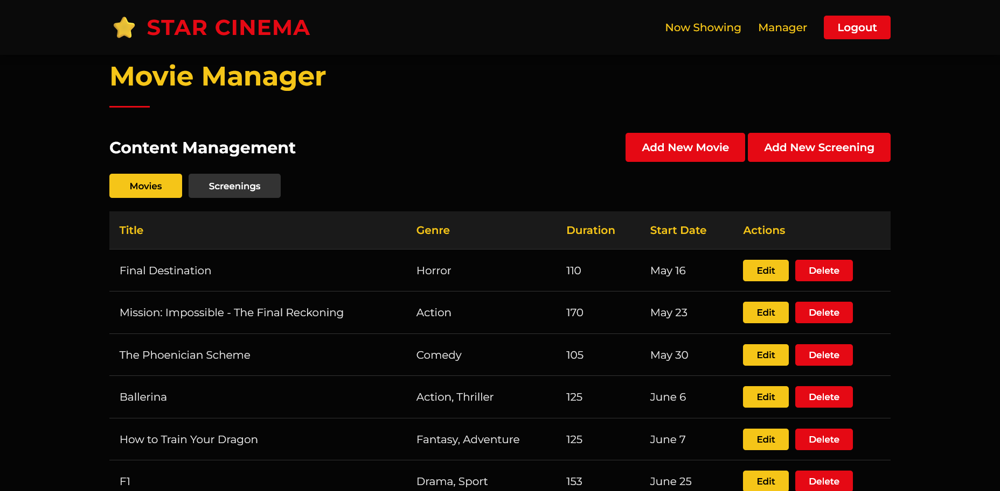
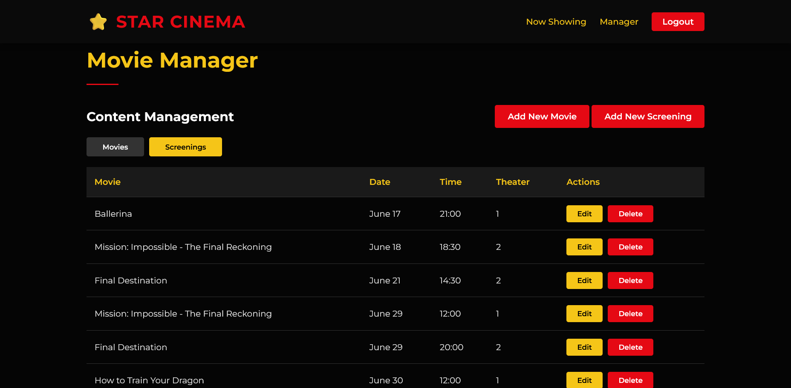
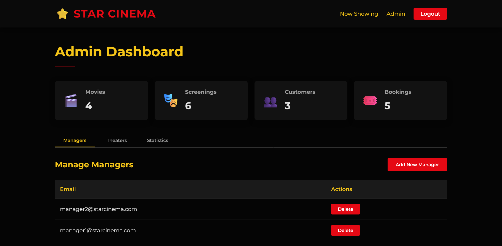
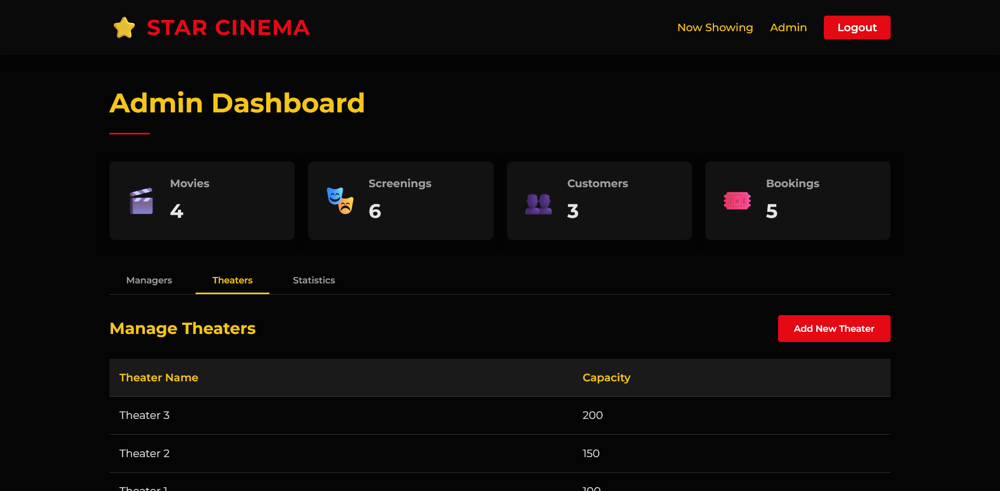

# ⭐ Star Cinema

A fully functional cinema booking platform developed using **HTML**, **CSS**, **JavaScript**, **PHP**, and **MySQL**.

This system supports **three user roles**—**Customer**, **Manager**, and **Admin**—with dedicated functionalities for each.

## User Roles & Permissions

### Customer
- View movies and available screenings
- Book screenings with seat selection
- View their own bookings

### Manager
- Add, edit, and delete movies
- Add, edit, and delete screenings

### Admin
- Add, edit, and delete theatres
- Add, edit, and delete managers
- View statistics

## Project Structure Overview

### Folders

- **admin/**  
  Contains all pages and scripts related to the admin user role. Admins can manage managers, theatres, and view system statistics.

- **auth/**  
  Contains authentication-related scripts such as login, logout, and registration functionalities.

- **css/**  
  Contains all CSS stylesheets for the website.

- **customer/**  
  Contains pages and scripts for the customer user role, like viewing their bookings.

- **docs/**  
  Documentation files for the project.

- **includes/**  
  Reusable components and scripts included across multiple pages, such as header, footer, and utility functions.

- **manager/**  
  Contains pages and scripts for the manager user role, including functionality to add, edit, and remove movies and screenings.

- **sql/**  
  Contains SQL scripts for database schema creation and sample data inserts.

### Files in Root Directory

- **.gitignore**  
  Specifies intentionally untracked files to ignore in Git version control.

- **404.php**  
  Custom 404 error page shown when a user navigates to a non-existent page.

- **README.md**  
  Project documentation and overview.

- **index.php**  
  The main landing page of the website.

- **movie-details.php**  
  Page displaying detailed information about a selected movie.

- **seat-selection.php**  
  Page for selecting seats when booking a screening.

## Screenshots

### Customer Views

**All Movies Page**  
  
Browse all movies that are showing now or coming soon.

**Movie Details Page**  
  
View details about a movie and its screenings.

**Booking Page**  
  
Select screenings and book seats.

**Booked Screenings Page**  
  
View a list of all your booked screenings.

### Manager Views

**Manage Movies Page**  
  
Add, edit, or delete movies.

**Manage Screenings Page**  
  
Control screening schedules.

### Admin Views

**Admin Dashboard**  
  
Overview of statistics and management tools.

**Manage Managers Page**  
  
Add, edit, or delete manager accounts.

**Manage Theatres Page**  
  
Manage theatre details.